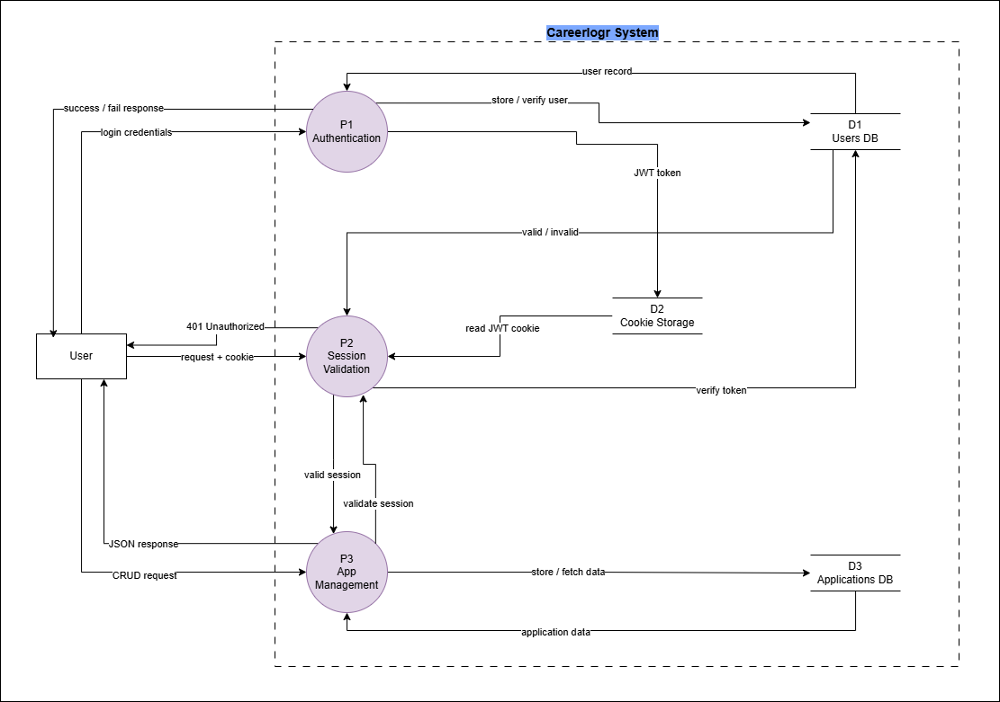

# 📊 CareerLogr

CareerLogr is a full-stack CRUD application designed to help users track and manage their job applications in one place.

It was built from a real personal problem:  
managing job applications using scattered notes, Excel sheets, and memory became difficult — so this app centralizes everything into a simple, structured system.

---

# 💡 Problem Statement

When applying for jobs, it becomes hard to track:

- Where you applied
- Company details
- Application status
- Interview progress
- Follow-ups

Most people end up using Excel sheets or random notes.

CareerLogr solves this by providing a **centralized job application tracker**.

---

# 🚀 Features

## 📦 Core CRUD System
- Add job applications
- Update application details
- Delete applications
- View all applications in one dashboard

## 🔐 Authentication
- User registration & login
- JWT-based authentication
- Secure HTTP-only cookie sessions

## 📊 Dashboard Overview
- Total applications
- Status tracking (applied, interview, rejected, etc.)
- Simple analytics view

---

# 🧠 System Overview

CareerLogr follows a simple 3-layer architecture:

- Frontend: React (UI)
- Backend: Node.js + Express (API logic)
- Database: MongoDB (data storage)

---

# 🔁 Data Flow (Level 1 Concept)

1. User registers or logs in  
2. Backend generates JWT token  
3. Token is stored in browser cookie  
4. Every request goes through session validation middleware  
5. If valid → CRUD operations allowed  
6. If invalid → 401 Unauthorized  

---

# ⚙️ Tech Stack

## Frontend
- React (Vite)
- React Router
- React Query (TanStack Query)
- Tailwind CSS
- Recharts
- React Hook Form
- React Hot Toast

## Backend
- Node.js
- Express.js
- MongoDB (Native Driver)
- JWT (jsonwebtoken)
- bcryptjs
- cookie-parser
- cors
- dotenv

---

# 🔐 Authentication Flow

- User logs in / registers
- Server validates credentials
- JWT token is created
- Token is stored in HTTP-only cookie
- Browser automatically sends cookie with every request
- Backend middleware verifies token
- Access granted or denied

---

# 📦 API Structure

## Auth Routes
- `POST /auth/register`
- `POST /auth/login`
- `GET /auth/me`

## Application Routes
- `GET /applications`
- `POST /applications`
- `PUT /applications/:id`
- `DELETE /applications/:id`

(All application routes are protected)

---

# 🧩 Key Concept: Session Validation

Session validation is handled using backend middleware that:

- Extracts JWT from cookie
- Verifies it using server secret
- Attaches user identity to request
- Blocks unauthorized access (401)

---

# 📊 Data Flow Diagram

(Add your Level 1 DFD here from draw.io)

---

# 🧠 Why I built this project

This project was created to solve a personal workflow problem:

> “I needed a simple way to track where I applied, instead of relying on Excel sheets and scattered notes.”

---

# 📁 Project Structure

## Client
- React-based UI
- Dashboard and forms
- API integration using React Query

## Server
- REST API with Express
- Authentication system (JWT)
- CRUD logic for applications
- MongoDB database integration

---

# ⚠️ Important Notes

- JWT is verified in backend middleware (not database)
- Database is only for storing data
- Cookies are handled automatically by the browser
- Frontend handles UI routing after auth state

---

# 📈 Future Improvements

- Filter & search applications
- Status pipeline (applied → interview → offer)
- Resume attachment upload
- Email reminders for follow-ups
- Advanced analytics dashboard

---

# 📜 License

ISC